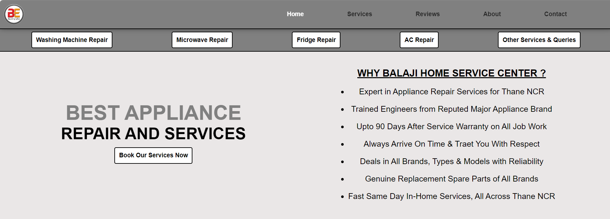
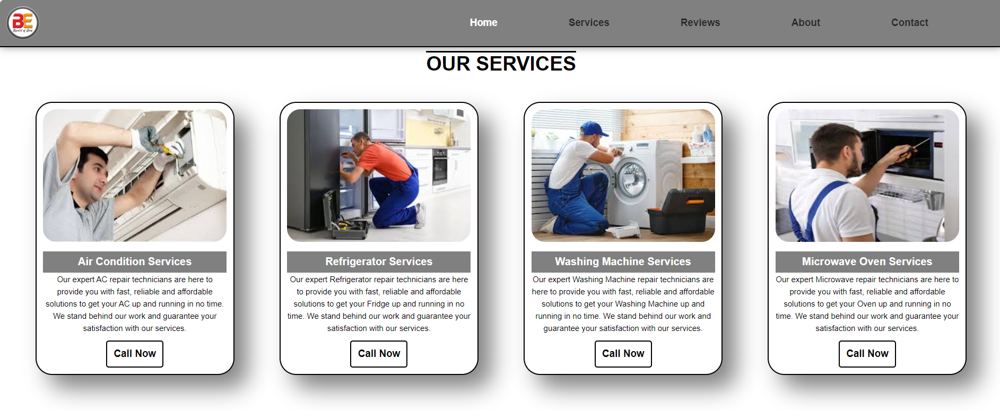
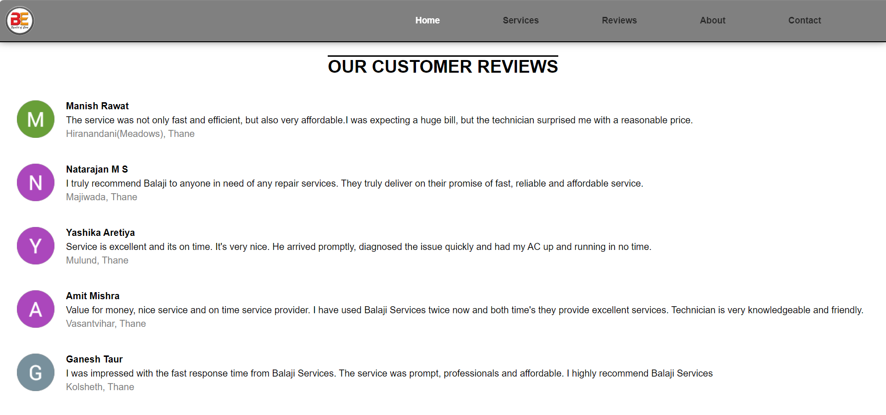
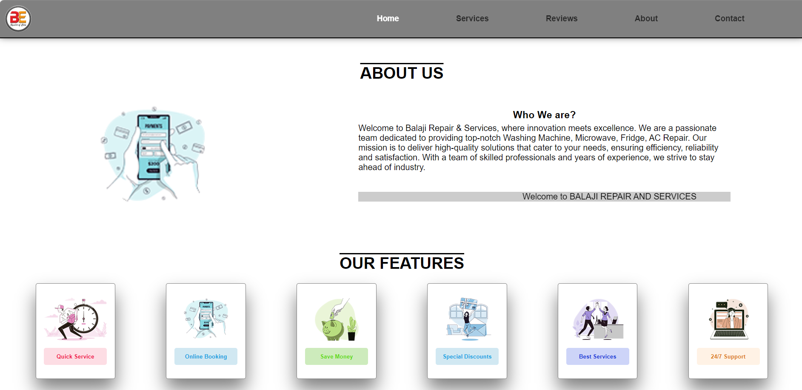
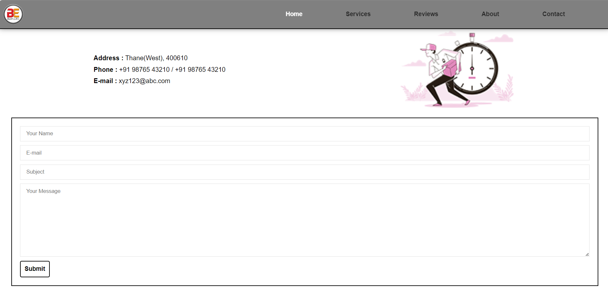
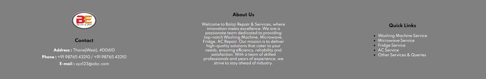

# Home Appliance Repair Website

A responsive frontend website for home appliance repair and maintenance services.  
This project is built using HTML and CSS and includes multiple sections such as services, customer reviews, features, contact form, and responsive layouts.

---

## 🚀 Features

- Responsive Design
- Modern UI Layout
- Service Sections
- Customer Reviews
- Contact Form
- Sticky Navigation Bar
- Smooth Scrolling
- Call-to-Action Buttons

---

## 🛠️ Technologies Used

- HTML5
- CSS3

---

## 📂 Project Structure

```bash
├── home.html
├── style.css
├── image/
│   ├── logo.jpeg
│   ├── s1.jpeg
│   ├── s2.jpeg
│   ├── ...
```
---

## 📸 Screenshots













---

## ⚙️ How to Run

1. Clone the repository

```bash
git clone https://github.com/anshu-Creates/home-appliance-repair-website.git
```

2. Open the project folder

```bash
cd home-appliance-repair-website
```

3. Run the project

- Open `home.html` in your browser

OR

- Use VS Code Live Server Extension

---

## 📌 Future Improvements

- Add JavaScript functionality
- Backend integration for contact form
- Online appointment booking system
- Dark mode support
- Improve animations and transitions
- Add authentication system
- Improve accessibility
- Add database support

---

## 👨‍💻 Author

Developed by Anshu.

